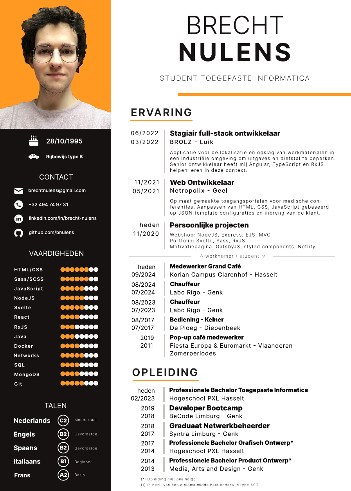

# Inleiding

Het portfolio voor het onderdeel Werkplekleren van de graduaatsopleiding Systeem- en Netwerkbeheer van de PXL is een persoonlijk document dat voor elke student dezelfde basis heeft maar een andere vorm zal krijgen over tijd. Op deze manier kan iedere student binnen het vak een inkijk bieden in zijn voortgang en kunnen de docenten bijsturen waar nodig om de student succesvol zijn curriculum te doen voltooien.

Dit is niet anders voor mij als een van de vele studenten binnen deze opleiding, waarbij ik mijn best tracht te doen om dit opleidingsonderdeel met enig succes te volbrengen. Ik voeg toe, ik annoteer en bespreek het verloop van de vele onderdelen en opdrachten binnen dit vak in dit document.

## Persoonlijke Info

Voor meer persoonlijke (en ook meer professionele) informatie verwijs ik graag naar onderstaand currriculum vitae van het jaar 2024.

> _bewerkt op 8 januari 2025_

 

  <object data="../assets/pdf/brecht_nulens_2024.pdf" type="application/pdf" width="720px" height="1080px">
   <embed src="../assets/pdf/brecht_nulens_2024.pdf">
      
This browser does not support PDFs. Please download the PDF to view it: <a href="../assets/pdf/brecht_nulens_2024.pdf">Download PDF</a>.

    </embed>
  </object>

